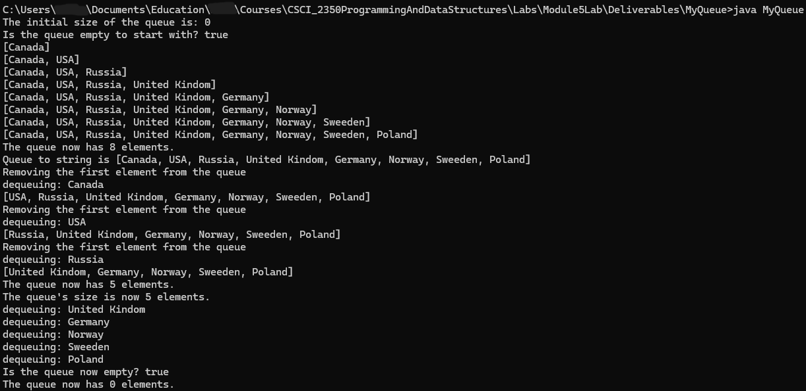

# MyQueue
MyQueue is a custom queue in Java that is composed of a custom MyLinkedList. 

## Table of contents
* [General Info](#General-info)
* [Author](#Author)
* [Programming Approaches](#Programming-approaches)
* [Techologies](#Technologies)
* [Setup](#Setup)
* [Usage](#Usage)
* [Minimum Hardware Requirements](#Minimum-hardware-requirements)
* [Screenshots](#Screenshots)
* [Project Status](#Project-status)
* [Room for Improvement](#Room-for-Improvement)
* [Release Date](#Release-date)
* [Works Cited](#Works-Cited)
* [Acknowledgements](#Acknowledgements)
* [Contact](#Contact)
* [Disclaimer](#Disclaimer)

## General info
- MyQueue utilizes a custom MyLinkedList that uses a Node class and implements the List and LinkedList interfaces (as a demonstration of multiple implementations of interfaces).
- The MyQueue class implements the Queue interface, which defines what methods a queue should have (an example of programming by contract).
- All of these classes use generics.

## Author
- Jason Ash, Computer Science Major

## Programming approaches
- My implementation of MyLinkedList closely matches the one in the textbook (Liang, 2024).
- The Node class also closely matches what is in our textbook (Liang, 2024).
- Rather than allow other classes to have access to a node's element and next node, I made accessor and mutator methods for these private data fields.
- I also wrote a short hasNext() method in the Node class for iterating through the nodes.
- The LinkedList interface has abstract methods for actions that pertain to LinkedList, such as getFirst(), getLast(), addFirst(), addLast(), removeFirst(), and removeLast().
- Unlike MyArrayList within MyStack, MyLinkedList does not inherit from an abstract class.
- The Queue interface defines actions common to queues, such as enqueue(), dequeue(), peek(), getSize(), and isEmpty().
- The MyQueue class creates a queue by composition in which an internal private MyLinkedList object is created, and queue methods call their corresponding MyLinkedList methods.
- For example, enqueue() calls the MyLinkedList.addLast(E item) method and dequeue() calls the MyLinkedList removeFirst() method.
- The main() method creates a MyQueue object of type String to test the MyQueue class.
- A LinkedList is more efficient than an ArrayList for a queue because removing elements happens at the front, which is O(1) for a LinkedList vs. O(n) for an ArrayList.
- I also followed a suggestion in the third chapter on sorted and unsorted lists in *Object-Oriented Data Structures* by N. Dale, D.T. Joyce, and C. Weems on returning a copy of the object that was gotten or removed from a list to ensure information hiding and better encapsulation.
- The MyQueue.java file contains all of the internal classes necessary to run it, and all of these classes are in one file because this was the requirement for the assignment submission.
- Since the program uses generics (which is a beneficial programming technique), the compiler will complain that MyQueue.java uses unchecked or unsafe operations (which is just its way of saying it cannot guarantee type casting of objects into their actual type, such as String).
- There is no way to prevent or suppress this message when using generics, but Java bytecode is still compiled into classes within the directory that MyStack.java is saved to, and the program can still be run with the javac command.

## Technologies:
I wrote the source code in Notepad in Windows 11, compiled it in the Command Prompt using the javac command, and ran it using the java command.

## Setup
To compile the .java file into Java bytecode, you can use the command line like I did or your favorite IDE of choice.

## Usage
- Type java MyQueue in the command line after compiling it, and the output should be the same as the screenshot below.

## Minimum hardware requirements
- Although I developed this on a fairly recent Windows 11 PC, this program should run comfortably on any working computer with sufficient processing power, RAM, a monitor manufactured within the past 15-20 years, and an Internet connection to download the .java source files.
- I used JDK version 21 to compile this source code, so your computer will have to be capable of installing and running that version of the JDK and its corresponding built-in JRE.

## Screenshots

## Project status
- This program met or exceeded the requirements for this part of Lab 5, so I'm releasing my solution on GitHub.

## Room for Improvement
- The methods that my textbook left as an exercise in the LinkedList implementation could be programmed.

## Release date
19 Aug, 2026

## Works Cited
- Dale, Nell, Joyce, Daniel T., and Weems, Chip. *Object-Oriented Data Structures Using Java*. Jones and Bartlett Learning, 2002.

- Liang, Y. Daniel. *Introduction to Java Programming and Data Structures*. 13th ed., Pearson Education Limited, 2024.

## Acknowledgements
- Prof. Dr. Ibrahim AL-Agha is the project advisor.

## Contact
Jason Ash - wizardofki@gmail.com

## Disclaimer
MyQueue.java is released under the GNU Public License 3.0. This software and source code are expressly provided "AS IS." I (Jason Ash) MAKE NO WARRANTY OF ANY KIND, EXPRESS, IMPLIED, IN FACT, OR ARISING BY OPERATION OF LAW, INCLUDING, WITHOUT LIMITATION, THE IMPLIED WARRANTY OF MERCHANTABILITY, FITNESS FOR A PARTICULAR PURPOSE, NON-INFRINGEMENT, AND DATA ACCURACY. I NEITHER REPRESENT NOR WARRANT THAT THE OPERATION OF THE SOFTWARE WILL BE UNINTERRUPTED OR ERROR-FREE, OR THAT ANY DEFECTS WILL BE CORRECTED. I DO NOT WARRANT OR MAKE ANY REPRESENTATIONS REGARDING THE USE OF THE SOFTWARE OR THE RESULTS THEREOF, INCLUDING BUT NOT LIMITED TO THE CORRECTNESS, ACCURACY, RELIABILITY, OR USEFULNESS OF THE SOFTWARE.
